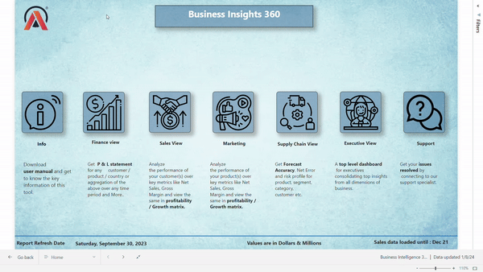
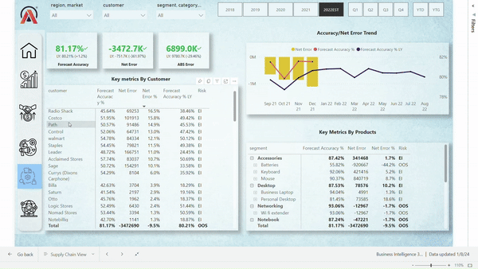

#  AtliQ_Hardware : Business_Insights_360_Project

## Live Report
[Link to Live Power BI Report](https://app.powerbi.com/view?r=eyJrIjoiYjdkZmY3YzMtNTVmNS00NDRhLWE3YTYtOTFjYjRiOGUyZTJmIiwidCI6ImM2ZTU0OWIzLTVmNDUtNDAzMi1hYWU5LWQ0MjQ0ZGM1YjJjNCJ9&pageName=ReportSectionb7abc32aae5628040c4d)

## Project Overview

AtliQ Hardware has experienced rapid growth in recent years, expanding its business globally. To sustain this growth and remain competitive, the company has decided to implement data analytics using Power BI. This project aims to provide stakeholders with actionable insights across various aspects such as finance, sales, marketing, and supply chain.

This initiative is crucial for making data-driven decisions, helping AtliQ Hardware surpass its competitors and avoid costly mistakes like the recent unprofitable expansion in the American market.

This project was developed by following the Codebasics Power BI Course, which offers comprehensive training on Power BI.

## Company Background
AtliQ Hardware sells computers and accessories globally through three primary channels:

- Retailers
- Direct Sales
- Distributors

The company's recent decision to open a store in America based on surveys and Excel analysis led to unexpected losses. Competitors with advanced analytics teams outperformed AtliQ Hardware. As a result, the company decided to build its own analytics team to make data-driven decisions in the future.

## Tech Stack

- SQL: Used for querying and manipulating data.

- Power BI Desktop: The main tool used for creating the dashboards.

- Excel: Utilized for data preparation and initial analysis.

- DAX Language: Employed for creating measures and calculated columns.

- DAX Studio: Used for optimizing report performance.

 ##  Power BI Techniques Learned

Throughout the project, I learned and applied various Power BI techniques, including:

1.Project Kick-Off Questions:

- Objective: What is the goal of building this Power BI dashboard?

- Success Criteria: How will the success of this project be measured?

- Timeline: What is the project deadline?

- Preview: Do stakeholders expect a preview before the final release?

- Stakeholder Expectations: What are the hopes and fears of the stakeholders regarding this project?

- Audience: Who will be using the dashboard, and for what purpose?

- Resources: What data and resources are needed to build this dashboard?

- Design Inputs: Are there any specific design or view preferences from stakeholders?

2.Data Modeling:

- Dimensional Modeling: Implemented a Snowflake schema for the data model.

- Best Practices: Followed good data modeling practices to ensure optimal report performance.

3.Creating Calculated Columns and Measures:

- DAX: Used DAX language to create calculated columns and measures for enhanced data analysis.

- Divide Function: Utilized the DIVIDE() function to prevent division by zero errors.

4.Visualization Techniques:

- Bookmarks: Used bookmarks to switch between visuals.

- Page Navigation: Implemented buttons for seamless page navigation.

- Dynamic Titles: Created titles that dynamically update based on applied filters.

- KPI Indicators: Used KPI indicators to highlight key metrics.

- Conditional Formatting: Applied conditional formatting with icons and background colors for better visual appeal.

5.Data Validation:

- Ensured data accuracy through various validation techniques before using it in the report.

6.Power BI Services:

- Publishing Reports: Published the reports to Power BI Services.

- Personal Gateway: Set up a personal gateway for automatic data refresh.

- Power BI App Creation: Created an app for easy access to the reports.

- Collaboration: Managed collaboration, workspaces, and access permissions within Power BI Services.

 ##  Business Terminology
Understanding key business-related terms was crucial for this project. Some of these include:

1. Gross Price: The total price before any deductions.

2. Pre-Invoice Deductions: Deductions applied before the invoice is generated.

3 .Post-Invoice Deductions: Deductions applied after the invoice is generated.

4. Net Invoice Sale: The sale amount after all deductions.

5. Gross Margin: The difference between net sales and the cost of goods sold (COGS).

6. YTD (Year to Date): The period starting from the beginning of the current year up to the current date.
 
 7. YTG (Year to Go): The period from the current date to the end of the year.

## Data Understanding
Before diving into analysis, it’s important to understand the available data:

### 1. Database: gdb041

**Dimension Tables:**

**1. dim_customer :** Contains customer details across 27 distinct markets and 2 platform types (Brick & Mortar, E-commerce).

**2. dim_market :** Contains details of 27 distinct markets, divided into 7 sub-zones and 4 regions (APAC, EU, NAN, LATAM).

**3. dim_product :** Contains product details, including divisions like Peripherals, Accessories, Networking, and Storage.

**- Fact Tables:**

**1. fact_forecast_monthly :**  Forecasts customer needs monthly to improve customer satisfaction and reduce storage costs.
**2. fact_sales_monthly :**  Contains actual sales data, structured similarly to the forecast table.

### 2.Database: gdb056

**Cost-Related Tables:**

**1.freight_cost:** Travel and other costs per market with fiscal year details.

**2.gross_price:** Contains gross prices with product codes.

**3.manufacturing_cost:** Contains manufacturing costs by product code and year.

**4.pre_invoice_deductions:** Contains pre-invoice deductions percentages for each customer by year.

**5.post_invoice_deductions:** Contains details of post-invoice deductions.

## Importing Data into Power BI

Data was imported from a MySQL database into Power BI using the appropriate credentials. Importing and connecting the data correctly was crucial for building the data model.

## Data Model

The data model is the foundation of the report. All visuals and analysis depend on a well-structured data model. Poor data modeling can significantly affect the report's performance. In this project, we followed the Snowflake schema to ensure a robust data model.

## Good Practices in Data Modeling

Following good practices in data modeling is essential for optimal performance. You can refer to this [blog](https://addendanalytics.com/blog/data-modelling-best-practices) for more information on best practices.

## Dashboard Designing 
Based on the mock ups received as requirement, the team will start designing the visuals and create measures.

## Home View 
In Home View, all the views button will be available.User will land on specific view page by clickin the button. The various views are:

- Info Page(Home Page)
- Finance View 
- Sales View 
- Marketing View 
- Supply Chain View 
- Executive View 

## Finance View

## Sales View

## Marketing View

## Supply Chain View 

## Executive View

You can find the full report here. [Report](https://app.powerbi.com/view?r=eyJrIjoiYjdkZmY3YzMtNTVmNS00NDRhLWE3YTYtOTFjYjRiOGUyZTJmIiwidCI6ImM2ZTU0OWIzLTVmNDUtNDAzMi1hYWU5LWQ0MjQ0ZGM1YjJjNCJ9&pageName=ReportSectionb7abc32aae5628040c4d)

## Project Outcome

This report enables data-driven decision-making, providing insights that support informed choices. Additionally, it helps answer numerous "why" questions related to various situations by analyzing the underlying data.

   

